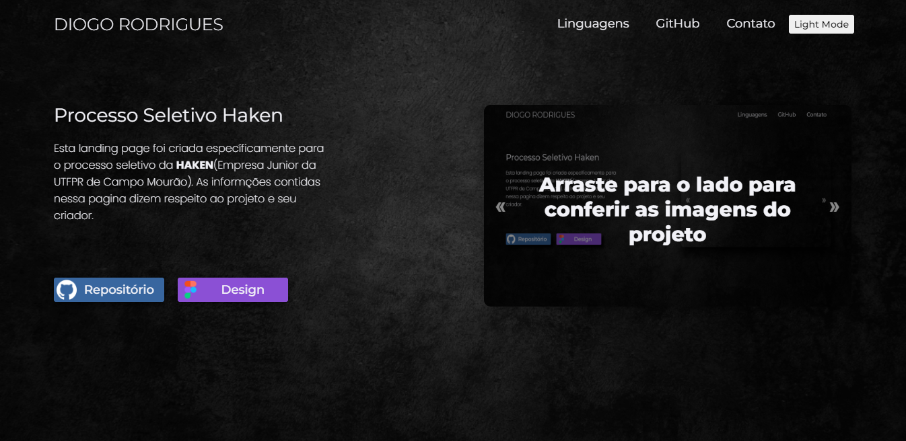
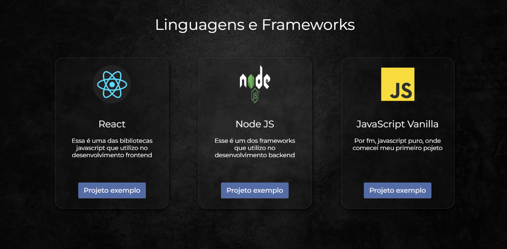
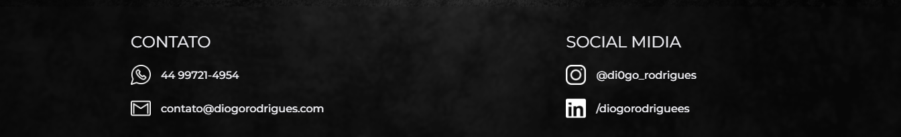
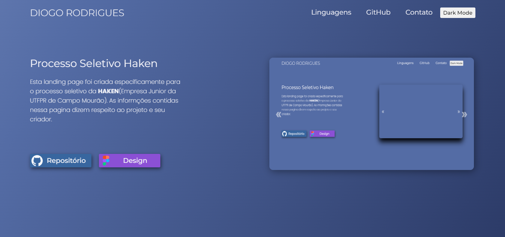
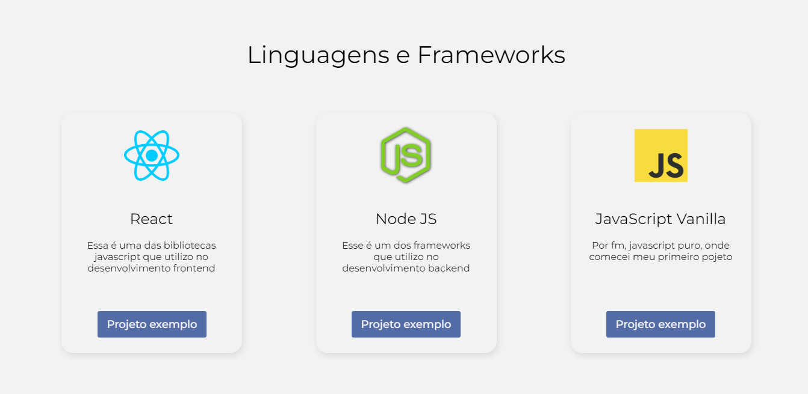
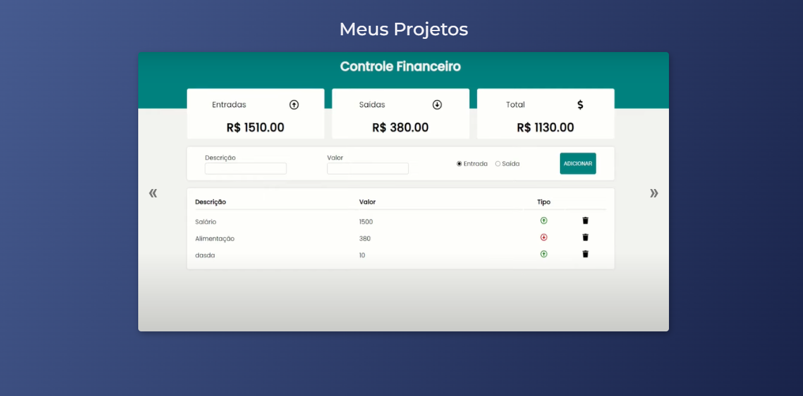
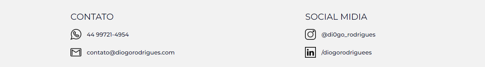

## Processo Seletivo Haken 2022/2
Repositório criado para o processo seletivo da Haken( Empresa junior de ciencia da computação ).  

## Como acessar?
- Acesse o site: <a target="_blank" href="https://diogorodrigues.com/">diogorodrigues.com</a>
- Ou clone o repositorio e abra o html com live server.

## Descrição
- O projeto precisa ser desenvolvido de forma individual, deve ser uma landing page responsiva(adaptado para mobile) e com dark mode(modo escuro). 
Exemplo de Landing Page: <a target="_blank" href="https://wonderfullandingpage.github.io/mylandingpage/">EXEMPLO</a>
- O tema fica por sua conta, você pode fazer sobre alguma empresa, anime, bot ou qualquer outra coisa fictícia (dúvidas entrar em contato).
- Utilize o git/github sempre que fizer modificações, não deixe para última hora nem faça o deploy do projeto inteiro de uma vez!!!
Essa é uma parte crucial da avaliação.
- Seja criativo!!!!

## Especificações Para o Processo Seletivo
O projeto deve: 
- Ser feito em HTML, CSS e Javascript.  
- Possuir responsividade.  
- Ter um padrão de escrita.  
- Ser escrito em português ou inglês.  
- Indentação Padronizada.  
- Comentários apenas quando necessário.  
- (opcional) Possuir darkmode.

## Prazo
- Inicio - 19/11/22  
- Fim - 04/12/22

## Tecnologias
- HTML5
- CSS3
- Javascript(ES6)

## Design
- <a href="https://www.figma.com/file/JA3mYFRQX5w7ekMTf4rrT7/Untitled?node-id=103%3A2&t=HdvLUZGs5k55tbDx-1">FIGMA</a>

## WEB View - Dark Mode

    <!--  -->
    
    
    
    

## WEB View - Light Mode

    
    
    
    

